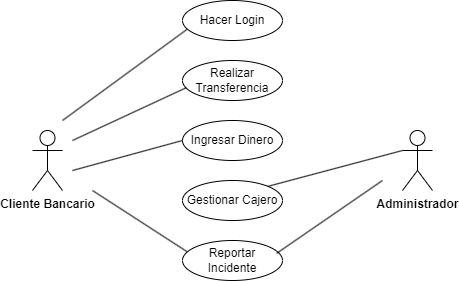

# Tarea Sistema de Gestión de un Cajero
___
### Descripción de la tarea
Crea un diagrama de casos de uso para un sistema de CAJERO. Los actores pueden ser "Administrador" y "Cliente bancario". Algunos casos de uso podrían ser "Hacer lógin", "Realizar transferencia", "Ingresar dinero", "ver saldo", "poner dinero al móvil",etc.

___
### Actores

#### 1er Actor
|  Actor | Cliente Bancario |
|---|---|
| Descripción  |Persona que utiliza el cajero automático para realizar transacciones bancarias.|
| Características  |Realiza operaciones bancarias como transferencias, retiros o consultas de saldo.|
| Relaciones |No tiene relación directa con otros actores. Realiza acciones sobre el sistema del cajero automático.|
| Referencias | Hacer lógin, Realizar transferencia, Ingresar dinero, Reportar Incidente|   
|  Notas |Puede haber diferentes tipos de clientes, como clientes regulares o clientes preferentes.|
| Autor  | Eduardo Rabadán Melián |
|Fecha | 11/02/2024 |

#### 2º Actor
|  Actor | Administrador |
|---|---|
| Descripción  |Persona encargada de la gestión y administración del sistema del cajero automático.|
| Características  |Tiene acceso privilegiado para gestionar usuarios, supervisar transacciones y mantener el funcionamiento del sistema.|
| Relaciones | No tiene relación directa con los clientes bancarios. Realiza acciones sobre el sistema del cajero automático.|
| Referencias | Gestionar Usuarios, Reportar Incidentes|   
|  Notas |Puede haber diferentes roles de administradores, como administrador principal y administradores de sucursales.|
| Autor  | Eduardo Rabadán Melián |
|Fecha | 11/02/2024 |
___
### Casos de Uso

#### 1. Hacer Login :

|  Caso de Uso	CU | Hacer Login |
|---|---|
| Fuentes  | Entidad Bancaria |
| Actor  | Cliente Bancario |
| Descripción |El Cliente Bancario inicia sesión en el sistema del cajero automático.|
| Flujo básico |1-> El Cliente Bancario introduce su tarjeta bancaria en el cajero automático. 2-> El Cliente Bancario ingresa su código PIN. 3-> El Sistema valida la información y permite el acceso al cliente.|
| Pre-condiciones |El Cliente Bancario tiene una cuenta bancaria activa.|  
| Post-condiciones  |El Cliente Bancario accede a las funciones disponibles en el cajero automático.|  
|  Requerimientos | La tarjeta bancaria debe ser válida y activa.|
|  Notas |El Cliente Bancario puede ser bloqueado después de múltiples intentos fallidos de inicio de sesión.|
| Autor  | Eduardo Rabadán Melián |
|Fecha | 11/02/2024 |

#### 2. Realizar Transferencia :

|  Caso de Uso	CU | Realizar Transferencia |
|---|---|
| Fuentes  | Entidad Bancaria |
| Actor  | Cliente Bancario |
| Descripción |El Cliente Bancario realiza una transferencia de fondos entre cuentas bancarias.|
| Flujo básico |1-> El Cliente Bancario selecciona la opción de transferencia de fondos en el cajero automático. 2-> El Cliente Bancario ingresa el monto y la cuenta destino de la transferencia. 3-> El Cliente Bancario confirma la transferencia. 4-> El Sistema procesa la transferencia y actualiza los saldos de las cuentas involucradas.|
| Pre-condiciones |El Cliente Bancario ha iniciado sesión en su cuenta y tiene fondos suficientes para la transferencia.|  
| Post-condiciones  |Se realiza la transferencia de fondos entre cuentas bancarias y se actualizan los registros en el sistema.|  
|  Requerimientos | La cuenta destino de la transferencia debe ser válida y activa.|
|  Notas |Se pueden aplicar límites de transferencia y comisiones según las políticas del banco.|
| Autor  | Eduardo Rabadán Melián |
|Fecha | 11/02/2024 |

#### 3. Ingresar Dinero :

|  Caso de Uso	CU | Ingresar Dinero |
|---|---|
| Fuentes  | Entidad Bancaria |
| Actor  | Cliente Bancario |
| Descripción |El Cliente Bancario realiza un depósito de dinero en efectivo en su cuenta bancaria.|
| Flujo básico |1-> El Cliente Bancario selecciona la opción de ingreso de dinero en el cajero automático. 2-> El Cliente Bancario introduce el dinero en efectivo en el lector de billetes. 3-> El Sistema valida el importe ingresado y lo registra en la cuenta del cliente. 4-> El Cliente Bancario confirma la transacción.|
| Pre-condiciones |El Cliente Bancario ha iniciado sesión en su cuenta y tiene efectivo para ingresar.|  
| Post-condiciones  |Se registra el depósito de dinero en la cuenta bancaria del Cliente Bancario y se actualiza el saldo.|  
|  Requerimientos |El cajero automático debe tener suficiente capacidad para aceptar y validar billetes.|
|  Notas |Se pueden aplicar límites de depósito según las políticas del banco.|
| Autor  | Eduardo Rabadán Melián |
|Fecha | 11/02/2024 |

#### 4. Gestionar Cajero :

|  Caso de Uso	CU | Gestionar Cajero |
|---|---|
| Fuentes  | Entidad Bancaria |
| Actor  | Administrador |
| Descripción |El Administrador realiza operaciones de mantenimiento y gestión sobre el cajero automático.|
| Flujo básico |1-> El Administrador accede al sistema de gestión del cajero automático. 2-> El Administrador puede realizar acciones como recargar efectivo, reiniciar el sistema, actualizar software, etc. 3-> El Administrador confirma la operación realizada.|
| Pre-condiciones |El Administrador ha iniciado sesión en el sistema de gestión del cajero automático.|  
| Post-condiciones  |Se realizan las operaciones de mantenimiento o gestión seleccionadas en el cajero automático.|  
|  Requerimientos |El Administrador debe tener los permisos adecuados para realizar las acciones seleccionadas.|
|  Notas |Las operaciones de mantenimiento pueden afectar la disponibilidad y funcionalidad del cajero automático.|
| Autor  | Eduardo Rabadán Melián |
|Fecha | 11/02/2024 |

#### 5. Reportar Incidente :

|  Caso de Uso	CU | Reportar Incidente |
|---|---|
| Fuentes  | Entidad Bancaria |
| Actor  | Cliente Bancario, Administrador |
| Descripción |El Cliente Bancario reporta un incidente o problema con el cajero automático al Administrador.|
| Flujo básico |1-> El Cliente Bancario detecta un problema o incidente con el cajero automático, como un fallo en la operación o una anomalía en la pantalla. 2-> El Cliente Bancario busca la opción de reportar incidente en la interfaz del cajero automático. 3-> El Cliente Bancario describe el incidente y envía el reporte al Administrador. 4-> El Sistema notifica al Administrador sobre el incidente reportado por el Cliente Bancario. 5-> El Administrador recibe la notificación y se encarga de investigar y resolver el incidente reportado.|
| Pre-condiciones |El Cliente Bancario ha iniciado sesión en el cajero automático y ha detectado un problema o incidente.|  
| Post-condiciones  |El Administrador investiga y resuelve el incidente reportado por el Cliente Bancario.|  
|  Requerimientos |El cajero automático debe tener un sistema de reporte de incidentes integrado.|
|  Notas |El reporte de incidente puede incluir detalles como la ubicación del cajero automático y la descripción del problema.|
| Autor  | Eduardo Rabadán Melián |
|Fecha | 11/02/2024 |