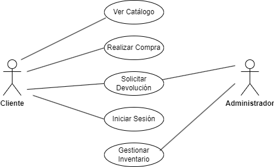

# Tarea Sistema de Gestión de Tienda en Línea
___
### Descripción de la tarea
Diseña un diagrama de casos de uso para un sistema de gestión de tienda en línea. Los actores pueden ser "Cliente" y "Administrador". Casos de uso incluyen "Ver Catálogo", "Realizar Compra", "Gestionar Inventario", etc.

___
### Actores

#### 1er Actor
|  Actor | Cliente |
|---|---|
| Descripción  | Persona que realiza compras en la tienda en línea.|
| Características  | Usuario registrado en el sistema. Realiza compras y gestiona su carrito.|
| Relaciones | Puede tener una relación similar con otros clientes al realizar acciones de compra. No hay relación directa con el Administrador.|
| Referencias | Ver Catálogo, Realizar Compra, Gestionar Carrito, Iniciar Sesión, Registrarse.|   
|  Notas | Puede haber diferentes roles de clientes, como cliente habitual o cliente ocasional.|
| Autor  | Eduardo Rabadán Melián |
|Fecha | 09/02/2024 |

#### 2º Actor
|  Actor | Administrador |
|---|---|
| Descripción  | Persona encargada de la gestión y administración del sistema de la tienda en línea.|
| Características  | Usuario con acceso privilegiado. Gestiona inventario y genera reportes.|
| Relaciones | No hay relación directa con los clientes. Tiene relación con otros administradores en sistemas multiusuario. |
| Referencias | Gestionar Inventario, Generar Reportes.|   
|  Notas | Puede haber diferentes roles de administradores, como administrador principal y administrador de inventario.|
| Autor  | Eduardo Rabadán Melián |
|Fecha | 09/02/2024 |
___
### Casos de Uso

#### 1. Ver Catálogo:

|  Caso de Uso	CU | Ver Catálogo  |
|---|---|
| Fuentes  | Tienda en Línea |
| Actor  | Cliente |
| Descripción |El Cliente visualiza el catálogo de productos disponibles en la tienda en línea.|
| Flujo básico |1-> El Cliente inicia sesión en el sistema. 2-> El Cliente accede al catálogo de productos. 3-> El Sistema muestra el catálogo de productos disponibles.|
| Pre-condiciones |El Cliente está autenticado en el sistema.|  
| Post-condiciones  |El Sistema muestra el catálogo de productos.|  
|  Requerimientos | Ninguno en particular. |
|  Notas |Puede haber opciones de filtrado o búsqueda en el catálogo.|
| Autor  | Eduardo Rabadán Melián |
|Fecha | 09/09/2024 |

#### 2. Realizar Compra:

|  Caso de Uso	CU | Realizar Comprar  |
|---|---|
| Fuentes  | Tienda en Línea |
| Actor  | Cliente |
| Descripción |El Cliente realiza la compra de productos seleccionados en la tienda en línea.|
| Flujo básico |1-> El Cliente visualiza el catálogo de productos. 2-> El Cliente selecciona productos para comprar. 3-> El Cliente procede al proceso de pago y realiza la compra.|
| Pre-condiciones |El Cliente ha iniciado sesión y ha seleccionado productos para comprar.|  
| Post-condiciones  |El Sistema registra la compra y actualiza el inventario.|  
|  Requerimientos |Los productos seleccionados deben estar disponibles en el inventario.|
|  Notas |El Cliente puede revisar su historial de compras después de realizar la compra.|
| Autor  | Eduardo Rabadán Melián |
|Fecha | 09/09/2024 |

#### 3. Solicitar Devolución:

|  Caso de Uso	CU | Solicitar Devolución  |
|---|---|
| Fuentes  | Tienda en Línea |
| Actor  | Cliente, Administrador |
| Descripción |El cliente solicita la devolución de un producto comprado anteriormente.|
| Flujo básico |1-> El cliente inicia sesión en su cuenta. 2-> El cliente accede a su historial de compras. 3-> El cliente selecciona el producto que desea devolver. 4-> El cliente solicita la devolución del producto. 5-> El sistema registra la solicitud de devolución y notifica al administrador. 6-> El administrador revisa la solicitud de devolución. 7-> El administrador aprueba o rechaza la solicitud de devolución. ->8. Si la solicitud es aprobada, el sistema procesa la devolución y realiza los ajustes necesarios en el inventario y el historial de compras del cliente. 9-> El sistema notifica al cliente sobre el resultado de su solicitud de devolución.|
| Pre-condiciones |El cliente ha iniciado sesión en su cuenta y ha realizado una compra previa.|  
| Post-condiciones  |Se registra la solicitud de devolución en el sistema y se actualiza el estado del producto y el historial de compras del cliente según la decisión del administrador.|  
|  Requerimientos |El cliente debe haber recibido el producto y solicitar la devolución dentro del período de tiempo especificado en la política de devoluciones. El administrador debe revisar la solicitud de devolución dentro de un plazo determinado.|
|  Notas |El administrador puede necesitar más información del cliente para procesar la solicitud de devolución, como el motivo de la devolución o imágenes del producto recibido.|
| Autor  | Eduardo Rabadán Melián |
|Fecha | 09/09/2024 |

#### 4. Iniciar Sesión:

|  Caso de Uso	CU | Iniciar Sesión  |
|---|---|
| Fuentes  | Tienda en Línea |
| Actor  | Cliente |
| Descripción |El Cliente inicia sesión en el sistema para acceder a su cuenta y realizar acciones específicas|
| Flujo básico |1-> El Cliente accede a la página de inicio de sesión. 2-> El Cliente ingresa su nombre de usuario y contraseña. 3-> El Sistema verifica las credenciales del Cliente. 4-> El Cliente accede a su cuenta si las credenciales son válidas.|
| Pre-condiciones | El Cliente ha registrado una cuenta en el sistema.|  
| Post-condiciones  |El Cliente accede a su cuenta y puede realizar acciones específicas.|  
|  Requerimientos |Ninguno en particular.|
|  Notas |El Cliente puede recuperar su contraseña en caso de olvido.|
| Autor  | Eduardo Rabadán Melián |
|Fecha | 09/09/2024 |

#### 5. Gestionar Inventario:

|  Caso de Uso	CU | Gestionar Inventario  |
|---|---|
| Fuentes  | Tienda en Línea |
| Actor  | Administrador |
| Descripción |El Administrador gestiona el inventario de productos disponibles en la tienda en línea.|
| Flujo básico |1-> El Administrador accede al panel de administración del sistema. 2-> El Administrador agrega, modifica o elimina productos del inventario. 3-> El Sistema actualiza el inventario con los cambios realizados por el Administrador.|
| Pre-condiciones | El Administrador ha iniciado sesión en el sistema.|  
| Post-condiciones  |El inventario se actualiza con los cambios realizados por el Administrador.|  
|  Requerimientos |El Administrador tiene los permisos adecuados para gestionar el inventario.|
|  Notas |El Administrador puede también establecer precios, categorías y otras propiedades de los productos.|
| Autor  | Eduardo Rabadán Melián |
|Fecha | 09/09/2024 |
___
#### Autor
[Eduardo Rabadán Melián](https://github.com/edumel20)