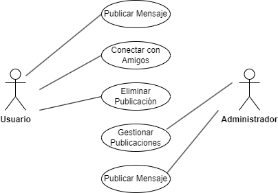

# Tarea Red Social
___
### Descripción de la tarea
Desarrolla un diagrama de casos de uso para una aplicación de red social. Los actores pueden ser "Usuario" y "Administrador". Casos de uso incluyen "Publicar Mensaje", "Conectar con Amigos", "Eliminar Publicación", etc.

### Actores

#### 1er Actor
|  Actor | Usuario |
|---|---|
| Descripción  |Persona que utiliza la aplicación de red social para interactuar con otros usuarios.|
| Características  |Crea publicaciones, se conecta con amigos y gestiona su perfil.|
| Relaciones |Puede conectarse con otros usuarios y tener interacciones en la red social. No tiene relación directa con el Administrador.|
| Referencias |Publicar Mensaje, Conectar con Amigos, Eliminar Publicación, Iniciar Sesión, Registrarse.|
| Notas |Puede haber diferentes tipos de usuarios, como usuarios estándar o usuarios verificados.|
| Autor  | Eduardo Rabadán Melián |
|Fecha |09/02/2024 |

#### 2º Actor
|  Actor | Administrador |
|---|---|
| Descripción  |Persona encargada de la gestión y administración de la aplicación de red social.|
| Características  |Tiene acceso privilegiado para gestionar publicaciones y usuarios en la red social.|
| Relaciones |No tiene relación directa con los usuarios. Tiene relación con otros administradores en sistemas multiusuario.|
| Referencias |Gestionar Publicaciones, Gestionar Usuarios.|
| Notas |Puede haber diferentes roles de administradores, como administrador principal y moderador.|
| Autor  | Eduardo Rabadán Melián |
|Fecha |09/02/2024 |

___
### Casos de Uso

#### 1. Publicar Mensaje:
|  Caso de Uso	CU | Publicar Mensaje  |
|---|---|
| Fuentes  | Red Social |
| Actor  |  Usuario |
| Descripción |El Usuario publica un mensaje en la aplicación de red social.|
| Flujo básico |1-> El Usuario redacta el mensaje. 2-> El Usuario selecciona la opción para publicar el mensaje. 3-> El Sistema registra el mensaje y lo muestra en el feed de noticias.|
| Pre-condiciones | El Usuario ha iniciado sesión en su cuenta.|  
| Post-condiciones  |El mensaje se publica en la aplicación y es visible para otros usuarios.|  
|  Requerimientos | Ninguno en particular. |
|  Notas |El Usuario puede agregar imágenes, videos o enlaces al mensaje.|
| Autor  | Eduardo Rabadán Melián |
|Fecha | 09/02/2024 |

#### 2. Conectar con Amigos:
|  Caso de Uso	CU | Conectar con Amigos  |
|---|---|
| Fuentes  | Red Social |
| Actor  |  Usuario |
| Descripción |El Usuario se conecta con otros usuarios para establecer relaciones de amistad en la red social.|
| Flujo básico |1-> El Usuario busca a otros usuarios para conectar. 2-> El Usuario envía una solicitud de amistad a un usuario encontrado.   3-> El Usuario espera la confirmación de la solicitud de amistad por parte del otro usuario. 4-> Una vez confirmada la solicitud, los usuarios se convierten en amigos en la red social.|
| Pre-condiciones |El Usuario ha iniciado sesión en su cuenta.|  
| Post-condiciones  |Se establece una relación de amistad entre los usuarios conectados.|  
|  Requerimientos | Ninguno en particular. |
|  Notas |Los usuarios pueden compartir publicaciones y contenido privado con sus amigos.|
| Autor  | Eduardo Rabadán Melián |
|Fecha | 09/02/2024 |

#### 3. Eliminar Publicación:
|  Caso de Uso	CU | Eliminar Publicación |
|---|---|
| Fuentes  | Red Social |
| Actor  |  Usuario |
| Descripción |El Usuario se conecta con otros usuarios para establecer relaciones de amistad en la red social.|
| Flujo básico |1-> El Usuario busca a otros usuarios para conectar. 2-> El Usuario envía una solicitud de amistad a un usuario encontrado.   3-> El Usuario espera la confirmación de la solicitud de amistad por parte del otro usuario. 4-> Una vez confirmada la solicitud, los usuarios se convierten en amigos en la red social.|
| Pre-condiciones |El Usuario ha iniciado sesión en su cuenta.|  
| Post-condiciones  |Se establece una relación de amistad entre los usuarios conectados.|  
|  Requerimientos | Ninguno en particular. |
|  Notas |Los usuarios pueden compartir publicaciones y contenido privado con sus amigos.|
| Autor  | Eduardo Rabadán Melián |
|Fecha | 09/02/2024 |

#### 4. Gestionar Publicaciones:
|  Caso de Uso	CU | Gestionar Publicaciones |
|---|---|
| Fuentes  | Red Social |
| Actor  | Administrador |
| Descripción |El Administrador gestiona las publicaciones realizadas por los usuarios en la aplicación de red social.|
| Flujo básico |1-> El Administrador accede al panel de administración del sistema. 2-> El Administrador revisa las publicaciones reportadas por los usuarios. 3-> El Administrador toma acciones como eliminar publicaciones inapropiadas o bloquear usuarios que violen las normas de la comunidad.|
| Pre-condiciones |El Administrador ha iniciado sesión en el sistema y tiene los privilegios adecuados para gestionar publicaciones.|  
| Post-condiciones  |Se toman acciones apropiadas sobre las publicaciones reportadas, manteniendo la integridad de la comunidad en la red social.|  
|  Requerimientos | Ninguno en particular. |
|  Notas |El Administrador puede necesitar comunicarse con los usuarios afectados durante el proceso de gestión de publicaciones.|
| Autor  | Eduardo Rabadán Melián |
|Fecha | 09/02/2024 |

#### 4. Gestionar Publicaciones:
|  Caso de Uso	CU | Gestionar Usuarios |
|---|---|
| Fuentes  | Red Social |
| Actor  | Administrador |
| Descripción |El Administrador gestiona los usuarios registrados en la aplicación de red social.|
| Flujo básico |1-> El Administrador accede al panel de administración del sistema. 2-> El Administrador busca y selecciona un usuario específico. 3-> El Administrador puede realizar acciones como bloquear, desbloquear, eliminar o editar la información del usuario seleccionado.|
| Pre-condiciones |El Administrador ha iniciado sesión en el sistema y tiene los privilegios adecuados para gestionar usuarios.|  
| Post-condiciones  |Se realizan las acciones seleccionadas sobre el usuario, manteniendo la integridad y seguridad de la comunidad en la red social.|  
|  Requerimientos | Ninguno en particular. |
|  Notas |El Administrador puede necesitar comunicarse con el usuario afectado durante el proceso de gestión de usuarios.|
| Autor  | Eduardo Rabadán Melián |
|Fecha | 09/02/2024 |