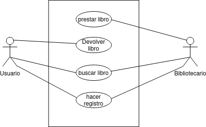

# Tarea Sistema de Biblioteca
___
### Descripción de la tarea
Desarrolla un diagrama de casos de uso para un sistema de biblioteca. Los actores pueden ser "Usuario" y "Bibliotecario". Algunos casos de uso podrían ser "Prestar Libro", "Devolver Libro", "Buscar Libro", etc.

___
### Actores

#### 1er Actor
|  Actor | Usuario |
|---|---|
| Descripción  | Se encarga de utilizar la aplicación|
| Características  | Es una persona que le dará uso a la aplicación y le dará diferentes usos |
| Relaciones | Se relaciona con el bibliotecario al darse de baja y alta y con el  sistema de registro, y al buscar libros en la aplicación de la biblioteca |
| Referencias | Se registra en la aplicación, buscar libro, devolver libro|   
| Autor  | Eduardo Rabadán Melián |
|Fecha |23/01/2024 |

#### 2º Actor
|  Actor | Bibliotecario |
|---|---|
| Descripción  | Se encarga de utilizar y gestionar la aplicación|
| Características  | Es una persona que buscará los libros que haya reservado en la biblioteca y podrá dar de alta o baja en la aplicación |
| Relaciones | Se relaciona con el usuario al buscar el libro que éste desee, y revisará el estado de la cuenta del usuario en la aplicación  |
| Referencias | Prestará libros, buscará libros y revisará el registro del usuario en la aplicación |   
| Autor  | Eduardo Rabadán Melián |
|Fecha |23/01/2024 |
